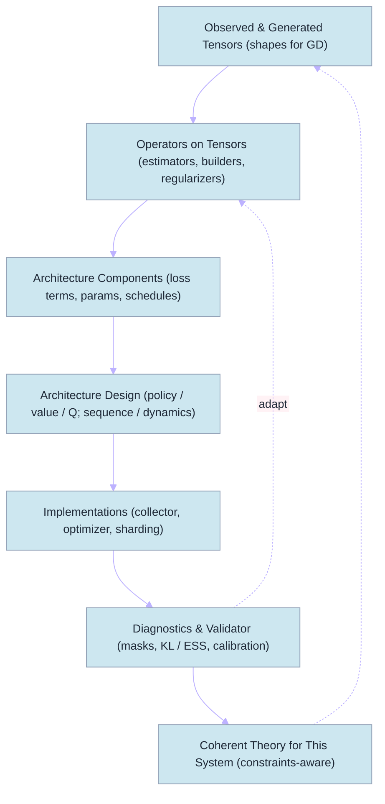

# Reversed RL (RRL) for System Engineers

A modest, practical abstraction to design RL systems from shapes to loss under real compute constraints. RRL starts with the tensors you can actually collect and optimize, then composes operators that consume those tensors to produce losses. Architectures are chosen to satisfy the operator interfaces, not the other way around.

This document complements PPO materials in this folder and provides a compact, engineer‑oriented reference with:
- A capability view of the batch contract
- Operator manifests (requirements, options, numerical hygiene)
- Pseudocode for the training loop
- Two ready‑to‑run configs to compare with/without a value network



---

## 1) Batch contract (shapes → loss)

Role‑tagged tensors (present only if needed by chosen operators):

- Identity/masks: `mask.valid` [B], `mask.terminal` [B]
- Observations/actions: `obs` [B,*S], `act` [B] or [B,D]
- Rewards/discounting: `rew` [B], `gamma` [B]
- Behavior/reference: `ref.logp` [B] (aka old logp), `behavior.logp` [B] (dataset policy; optional)
- Targets/signals: `target.adv` [B], `target.value` [B], `target.q` [B]
- Sequence (optional): `seq.rtg` [B], `seq.timestep` [B], `seq.attn_mask` [B,T]
- Weights (optional): `weight.entropy` [B], `weight.kl` [B], `weight.sample` [B]

Technical symbols use GitHub‑friendly LaTeX:

- Advantage: $A_t$; Returns/targets: $R_t$; Importance ratio: $r_t = \exp(\log\pi_\theta(a_t\mid o_t) - \log\pi_{\text{old}}(a_t\mid o_t))$.
- GAE deltas: $\delta_t = r_t + \gamma (1-d_t) V(o_{t+1}) - V(o_t)$; $A_t$ via $\lambda$‑smoothing.

Display form examples:

$$
\mathcal{L}_\pi(\theta) = \mathbb{E}\,\Big[\min\big(r_t A_t,\; \mathrm{clip}(r_t,1-\varepsilon,1+\varepsilon) A_t\big)\Big]
$$

---

## 2) Capability view

Use capability flags to validate operator selection and fallbacks.

| Capability | Meaning | Enables |
|---|---|---|
| has_ref_logp | `ref.logp` present (on‑policy snapshot) | PG‑clip, KL penalties |
| has_obs_next | `obs_next`, `rew`, `gamma` present | TD/Huber, off‑policy critics |
| sequence_mode | sequence tensors present | DT/sequence BC |
| offline_mode | no on‑policy collection, optional `behavior.logp` | AWR/IQL/CQL |

Notes:
- Always multiply losses by `mask.valid`.
- Keep shapes static across steps to avoid recompiles.

---

## 3) Operator manifests (primitives)

Each operator declares required fields; optional fields refine stability. Pseudocode manifests below.

```text
Operator: PGClip (PPO‑style policy gradient)
requires: obs, act, ref.logp, target.adv, mask.valid
optional: weight.entropy, weight.kl
loss: L = −E[min(r*A, clip(r,1−ε,1+ε)*A)] − β·H + α·KL(ref||curr)
notes: normalize A per batch; track ratio histograms and clip fraction
```

```text
Operator: ValueMSE (critic)
requires: obs, target.value, mask.valid
optional: ref.value for clipped value loss
loss: L = E[0.5·(Vθ(obs) − target.value)^2]
notes: monitor value calibration; optional clipping against ref.value
```

```text
Operator: TDHuber (Q‑learning)
requires: obs, act, rew, gamma, obs_next, mask.valid
loss: L = E[ huber(Qθ(s,a) − target.q) ]
notes: compute target.q with target network; mask terminals
```

```text
Operator: AWRPolicy (offline/adv‑weighted BC)
requires: obs, act, target.adv, mask.valid
loss: L = E[ clip(exp(A/β), w_max) · (−logπθ(a|s)) ]
notes: choose β, w_max by throughput/variance constraints
```

---

## 4) Builders (signals from rollouts)

Pseudocode (fenced code) for common builders:

```python
def add_gae(batch, V, gamma: float, lam: float):
    # expects: rew[T,N], done[T,N], values[T+1,N]
    # produces: target.adv[T,N], target.value[T,N]
    adv = zeros_like(rew)
    gae = 0.0
    for t in reversed(range(T)):
        delta = rew[t] + gamma * (1 - done[t]) * values[t+1] - values[t]
        gae = delta + gamma * lam * (1 - done[t]) * gae
        adv[t] = gae
    target_value = adv + values[:-1]
    return batch.update({"target.adv": adv, "target.value": target_value})
```

```python
def add_logp_ref(batch, policy, params_frozen):
    # compute and store ref.logp under acting params
    logp_old = policy.log_prob(params_frozen, batch["obs"], batch["act"]) 
    return batch.update({"ref.logp": logp_old})
```

---

## 5) Generic training loop (pure function style)

```python
# Pseudo‑API
loss, metrics = aggregator.apply(operators, batch, model_fns, hyper, rng)
optimizer.step(loss)
```

```python
# PPO‑like skeleton
for step in range(num_updates):
    roll = collector.run(policy, T, N)  # yields obs, act, rew, done, values, logp_old
    batch = builders.add_gae(roll, V=values, gamma=γ, lam=λ)
    batch = {k: v.reshape(B, *v.shape[2:]) for k, v in batch.items()}  # B=T*N
    for epoch in range(K):
        for mb in minibatches(batch, size=MB):
            L = L_pg_clip(mb) + c_v*L_value(mb) + L_entropy(mb) + L_kl(mb)
            optimizer.step(L)
```

---

## 6) Two ready‑to‑run configs (compare with/without value)

Both configs are Python files returning an `ml_collections.ConfigDict`, matching `examples/ppo_nnx/ppo_main.py`.

- With value (standard PPO): `configs/crf_with_value.py`
- Policy‑only (no value loss): `configs/crf_policy_only.py` (sets `vf_coeff=0.0`)

Run examples:

```bash
# Standard PPO with value loss
python -m examples.ppo_nnx.ppo_main \
  --config=examples/ppo_nnx/configs/crf_with_value.py \
  --workdir=/tmp/ppo_crf_value

# Policy‑only variant (no value loss). Note: the critic output exists but is not trained.
python -m examples.ppo_nnx.ppo_main \
  --config=examples/ppo_nnx/configs/crf_policy_only.py \
  --workdir=/tmp/ppo_crf_policy_only
```

---

## 7) Equations (for reference)

GAE and PPO objectives in display math:

$$
\delta_t = r_t + \gamma (1-d_t) V(o_{t+1}) - V(o_t),\quad
A_t = \sum_{\ell\ge 0} (\gamma\lambda)^{\ell} \, \delta_{t+\ell}
$$

$$
\mathcal{L}_\pi = \mathbb{E}\,\Big[\min(r_t A_t, \operatorname{clip}(r_t,1-\varepsilon,1+\varepsilon) A_t)\Big],\quad
\mathcal{L}_V = \tfrac{1}{2}\,\mathbb{E}[(V_\theta(o_t) - R_t)^2]
$$

---

## 8) Practical notes

- If you want a true REINFORCE baseline‑free run, set `vf_coeff=0.0` and modify the collector to use $V(o_t)=0$ when building $A_t$ (not provided in this minimal example). The provided policy‑only config runs without training the value loss.
- Track diagnostics: ratio histograms, clip fraction, entropy, value calibration.
- Keep batch schemas and dtypes fixed to avoid recompiles under JIT.

---

## 9) RRL in context: Is this approach new?

Short answer:
- Conceptually, similar ideas exist (data‑centric ML, TRFL/RLax operators, Acme/RLlib systems, RLHF preference‑optimization, Decision Transformer). Many of these start from the batch/loss under compute constraints.
- As a cohesive, capability‑aware engineering methodology, RRL is distinctive: it elevates a role‑tagged tensor contract, operator manifests with explicit preconditions, a validator + diagnostics loop, and data‑driven adaptivity into a single, reproducible flow.

Relevant precedents (for honest positioning):
- Data‑centric AI (Ng) and “Software 2.0” (Karpathy): prioritize the objective/data contract; models serve the loss.
- Operator libraries: TRFL, RLax provide reusable RL targets/losses as tensor ops.
- Systems frameworks: Acme, RLlib stress capability‑driven components and validators.
- RLHF/RLAIF: batch‑first preference objectives (e.g., DPO/IPO/KTO) where batch fields dictate losses.
- Decision Transformer: sequence‑first schema (tokens, RTG, masks) → objective.

What feels distinctive in RRL (the value add):
- Role‑tagged batch as the primary API with explicit capability flags (e.g., has_ref_logp, has_obs_next, sequence_mode, offline_mode).
- Operator manifests with numerical hygiene (mask semantics, clipping/normalization, stop_gradient) and stated preconditions/costs.
- Validator + diagnostics that can add/remove operators or require new tensors when assumptions fail; fallbacks are explicit and measured.
- Data‑driven adaptivity built‑in: e.g., KL targeting and per‑sample clipping derived from batch statistics, not static knobs.
- Engineering‑first documentation with runnable ablations (with/without value network) under identical batch contracts.

Is it “new enough” to matter?
- Engineering practice: yes—RRL improves reproducibility, comparability, and iteration speed by fixing the batch contract and separating operators from models.
- Research novelty: potentially—if you formalize validator behavior and adaptive operators and validate across methods/datasets.

Concrete avenues to push novelty (examples):
- Assumption/capability checker that auto‑disables or re‑wires operators, logging the induced bias/variance trade‑off.
- Per‑sample adaptive clipping $\varepsilon_i$ from gradient‑variance proxies $\hat{\sigma}_{g,i}$; compare to fixed $\varepsilon$ on stability/sample‑efficiency.
- KL‑targeting with multiplicative updates to maintain a target divergence:

  $$\alpha \leftarrow \alpha \cdot \exp\big(\eta\,(\bar D_{\mathrm{KL}} - D_{\text{target}})\big).$$

- Unified diagnostics with pass/fail bands (ratio histograms centered near 1, clip fraction in healthy range, ESS thresholds, value calibration $R^2$) that predict instability and auto‑tune penalties.
- Cross‑family instantiations (PPO, REINFORCE+baseline, AWR) from the same batch + operators; quantify code delta and performance under equal compute.

How to position RRL:
- Not a brand‑new philosophy; a disciplined unification of scattered best practices.
- New as a coherent, capability‑aware, diagnostics‑driven engineering framework that starts from shapes → operators → loss, then lets theory serve the system.
