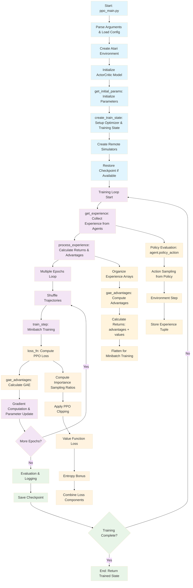

# PPO Implementation with Flax NNX

## Overview of the NNX Implementation

This directory contains a complete migration of the PPO (Proximal Policy Optimization) implementation from Flax Linen to the modern Flax NNX API. The implementation demonstrates how to leverage NNX's stateful modules, simplified training loops, and more intuitive object-oriented design for reinforcement learning.

The PPO implementation is a JAX/Flax-based reinforcement learning algorithm designed to train agents to play Atari games. The implementation follows the original PPO paper by Schulman et al. (2017) and showcases the benefits of the NNX API:

1. **Neural Network Architecture**: Defined in `models.py`, using NNX stateful modules with explicit layer definitions in `__init__` method.

2. **Agent Interaction**: Implemented in `agent.py`, simplified by eliminating separate parameter management through direct model usage.

3. **Environment Handling**: Managed in `env_utils.py`, which provides utilities for creating and interacting with Atari environments (unchanged from original).

4. **PPO Algorithm**: Core algorithm implemented in `ppo_lib.py`, using `nnx.Optimizer`, `nnx.value_and_grad`, and `@nnx.jit` for simplified training.

5. **Configuration**: Default hyperparameters defined in `configs/default.py` (unchanged from original).

## Key Differences from Linen Implementation

### 1. **Model Definition**
**Linen (Old):**
```python
class ActorCritic(nn.Module):
  num_outputs: int

  @nn.compact
  def __call__(self, x):
    x = nn.Conv(features=32, kernel_size=(8, 8), strides=(4, 4))(x)
    # ... inline layer definitions
```

**NNX (New):**
```python
class ActorCritic(nnx.Module):
  def __init__(self, num_outputs: int, *, rngs: nnx.Rngs):
    self.conv1 = nnx.Conv(in_features=4, out_features=32, ...)
    self.conv2 = nnx.Conv(in_features=32, out_features=64, ...)
    # ... explicit layer attributes
```

### 2. **Parameter Management**
**Linen (Old):**
```python
params = model.init(key, dummy_input)['params']
state = train_state.TrainState.create(apply_fn=model.apply, params=params, tx=tx)
```

**NNX (New):**
```python
model = ActorCritic(num_outputs=num_actions, rngs=nnx.Rngs(key))
optimizer = nnx.Optimizer(model, tx)
```

### 3. **Training Step**
**Linen (Old):**
```python
def train_step(state, trajectories, ...):
  grad_fn = jax.value_and_grad(loss_fn)
  loss, grads = grad_fn(state.params, state.apply_fn, batch, ...)
  state = state.apply_gradients(grads=grads)
```

**NNX (New):**
```python
@nnx.jit
def train_step(optimizer, trajectories, ...):
  loss, grads = nnx.value_and_grad(loss_fn)(optimizer.model, batch, ...)
  optimizer.update(grads)
```

### 4. **Policy Action**
**Linen (Old):**
```python
def policy_action(apply_fn, params, state):
  return apply_fn({'params': params}, state)
```

**NNX (New):**
```python
@nnx.jit
def policy_action(model, state):
  return model(state)
```

## Implementation Details

### Model Architecture (`models.py`)
The ActorCritic model uses a convolutional neural network architecture:
- **Input**: (batch, 84, 84, 4) - stacked Atari frames
- **Conv Layers**: 3 convolutional layers with ReLU activation
  - Conv1: 4→32 channels, 8×8 kernel, stride 4
  - Conv2: 32→64 channels, 4×4 kernel, stride 2  
  - Conv3: 64→64 channels, 3×3 kernel, stride 1
- **FC Layers**: 
  - Hidden: 7744→512 (flattened conv output)
  - Policy head: 512→num_actions (action logits)
  - Value head: 512→1 (state value)
- **Total Parameters**: 4,047,015

### Training Loop (`ppo_lib.py`)
Key NNX features used:
- `nnx.Optimizer` for integrated parameter and optimizer state management
- `nnx.value_and_grad` for gradient computation
- `@nnx.jit` for JIT compilation
- Direct model calls without separate parameter passing

### Testing and Validation
The implementation includes comprehensive tests:
- `test_minimal_nnx.py`: Core NNX functionality verification
- `test_core_nnx.py`: Advanced NNX features testing
- `debug_conv_dims.py`: Convolutional layer dimension verification
- `debug_params.py`: Parameter structure analysis

## Execution Flow

The execution flow of the NNX PPO implementation:

### PPO Execution Flow Diagram



### 1. Initialization
- Parse command-line arguments and load configuration
- Create the Atari environment
- Initialize the actor-critic model
- Set up remote simulators (one for each agent)
- Initialize the optimizer and training state
- Restore checkpoint if available

### 2. Training Loop
For each training step:
1. **Experience Collection**:
   - Each agent interacts with its environment for a fixed number of steps
   - States, actions, rewards, values, log probabilities, and done flags are collected
   - Experiences are processed to calculate returns and advantages using GAE

2. **Policy Update**:
   - For a specified number of epochs:
     - Shuffle the collected experiences
     - Split experiences into mini-batches
     - Compute the PPO loss (policy loss + value loss - entropy bonus)
     - Update the model parameters using gradients

3. **Evaluation and Logging**:
   - Periodically test the policy on the environment
   - Log metrics to TensorBoard
   - Save model checkpoints

## Detailed Execution Steps

### Step 1: Main Entry Point (`ppo_main.py`)
- Parses command-line arguments
- Sets up the environment and model
- Calls the training function

### Step 2: Environment Setup
- Creates Atari environments with preprocessing
- Applies frame stacking (4 frames)
- Optionally clips rewards to {-1, 0, 1}

### Step 3: Model Initialization
- Initializes the ActorCritic model with a CNN architecture
- The model outputs both policy log probabilities and value estimates

### Step 4: Training Process (`train` function in `ppo_lib.py`)
1. **Create Remote Simulators**:
   - Each simulator runs in a separate process
   - Communicates with the main process via pipes

2. **Main Training Loop**:
   - For each step in the training loop:
     - Collect experience from all agents
     - Process experience to calculate returns and advantages
     - Update policy multiple times on the collected data

3. **Experience Collection** (`get_experience` function):
   - For each step:
     - Get states from all simulators
     - Compute policy and value using the current model
     - Sample actions from the policy
     - Send actions to simulators and receive next states, rewards, etc.

4. **Experience Processing** (`process_experience` function):
   - Organize collected experiences into arrays
   - Calculate advantages using GAE (Generalized Advantage Estimation)
   - Calculate returns for value function training

5. **Policy Update** (`train_step` function):
   - Reshape trajectories into mini-batches
   - For each mini-batch:
     - Compute PPO loss
     - Compute gradients
     - Update model parameters

### Step 5: Loss Calculation (`loss_fn` function)
The PPO loss consists of three components:
1. **Policy Loss**: Clipped surrogate objective to prevent too large policy updates
2. **Value Loss**: Mean squared error between predicted values and returns
3. **Entropy Bonus**: Encourages exploration by rewarding policy entropy

### Step 6: Advantage Calculation (`gae_advantages` function)
- Uses Generalized Advantage Estimation (GAE)
- Balances bias and variance in advantage estimates
- Accounts for terminal states in the calculation

### Step 7: Evaluation and Checkpointing
- Periodically evaluates the policy by running test episodes
- Logs metrics to TensorBoard
- Saves model checkpoints for later resumption

The implementation uses JAX's just-in-time compilation (`jax.jit`) extensively to optimize performance, particularly for the training step and advantage calculation. It also leverages vectorization (`jax.vmap`) for efficient parallel computation across multiple agents.

Overall, this is a clean, efficient implementation of PPO that follows the original algorithm closely while taking advantage of JAX's performance optimizations.

## Theoretical Concepts Underlying the 8 Key Functions

### `gae_advantages()` - Generalized Advantage Estimation

**Theoretical Foundation:**
Generalized Advantage Estimation (GAE) was introduced by Schulman et al. (2016) to address the bias-variance tradeoff in policy gradient methods.

**Mathematical Formulation:**

The advantage function is defined as:
$$A^{\pi}(s_t, a_t) = Q^{\pi}(s_t, a_t) - V^{\pi}(s_t)$$

The temporal difference (TD) error is:
$$\delta_t^V = r_t + \gamma V(s_{t+1}) - V(s_t)$$

GAE defines the advantage estimator as:
$$\hat{A}_t^{GAE(\gamma,\lambda)} = \sum_{l=0}^{\infty} (\gamma\lambda)^l \delta_{t+l}^V$$

The recursive formulation implemented in the code:
$$\hat{A}_t^{GAE} = \delta_t + \gamma\lambda \hat{A}_{t+1}^{GAE}$$

where:
- $\gamma$ is the discount factor
- $\lambda$ is the GAE parameter controlling bias-variance tradeoff
- $\delta_t$ is the TD error at time $t$

**Implementation Details:**
```python
# TD error calculation
delta = rewards[t] + discount * values[t + 1] * terminal_masks[t] - values[t]
# GAE recursion
gae = delta + discount * gae_param * terminal_masks[t] * gae
```

### `loss_fn()` - PPO Loss Function

**Theoretical Foundation:**
PPO introduces a clipped surrogate objective to prevent destructively large policy updates while maintaining sample efficiency.

**Mathematical Formulation:**

The importance sampling ratio:
$$r_t(\theta) = \frac{\pi_\theta(a_t|s_t)}{\pi_{\theta_{old}}(a_t|s_t)}$$

The clipped surrogate objective:
$$L^{CLIP}(\theta) = \mathbb{E}_t[\min(r_t(\theta)\hat{A}_t, \text{clip}(r_t(\theta), 1-\epsilon, 1+\epsilon)\hat{A}_t)]$$

The complete PPO loss function:
$$L(\theta) = \mathbb{E}_t[L^{CLIP}(\theta) - c_1 L^{VF}(\theta) + c_2 S[\pi_\theta](s_t)]$$

where:
- $L^{VF}(\theta) = (V_\theta(s_t) - V_t^{targ})^2$ is the value function loss
- $S[\pi_\theta](s_t) = -\sum_a \pi_\theta(a|s_t) \log \pi_\theta(a|s_t)$ is the entropy bonus
- $c_1, c_2$ are coefficients for value function loss and entropy bonus
- $\epsilon$ is the clipping parameter

**Implementation Details:**
```python
# Importance sampling ratios
ratios = jnp.exp(log_probs_act_taken - old_log_probs)
# Clipped surrogate objective
pg_loss = ratios * advantages
clipped_loss = advantages * jax.lax.clamp(1.0 - clip_param, ratios, 1.0 + clip_param)
ppo_loss = -jnp.mean(jnp.minimum(pg_loss, clipped_loss), axis=0)
```

### `train_step()` - Minibatch Gradient Descent

**Theoretical Foundation:**
Implements stochastic gradient descent with minibatches for improved sample efficiency and computational stability.

**Mathematical Formulation:**

The gradient update rule:
$$\theta_{k+1} = \theta_k + \alpha \nabla_\theta L(\theta_k)$$

For minibatch training:
$$\nabla_\theta L(\theta) \approx \frac{1}{|B|} \sum_{i \in B} \nabla_\theta L_i(\theta)$$

where $B$ is a minibatch of size $|B|$.

**Adam Optimizer Update:**
$$m_t = \beta_1 m_{t-1} + (1-\beta_1) g_t$$
$$v_t = \beta_2 v_{t-1} + (1-\beta_2) g_t^2$$
$$\theta_t = \theta_{t-1} - \alpha \frac{\hat{m}_t}{\sqrt{\hat{v}_t} + \epsilon}$$

### `get_experience()` - On-Policy Data Collection

**Theoretical Foundation:**
PPO is an on-policy algorithm requiring fresh experience collection for each policy update.

**Mathematical Formulation:**

The experience tuple at time $t$:
$$\tau_t = (s_t, a_t, r_t, V(s_t), \log \pi_{\theta_{old}}(a_t|s_t), d_t)$$

Action sampling from current policy:
$$a_t \sim \pi_\theta(\cdot|s_t)$$

### `process_experience()` - Return and Advantage Computation

**Theoretical Foundation:**
Converts raw experience into training-ready format with proper return and advantage calculations.

**Mathematical Formulation:**

The discounted return:
$$R_t = \sum_{k=0}^{T-t} \gamma^k r_{t+k}$$

GAE-based return calculation:
$$R_t^{GAE} = \hat{A}_t^{GAE} + V(s_t)$$

### `get_initial_params()` - Neural Network Initialization

**Theoretical Foundation:**
Proper initialization is crucial for neural network training stability and convergence.

**Mathematical Formulation:**

Xavier/Glorot initialization for weights:
$$W \sim \mathcal{N}(0, \frac{2}{n_{in} + n_{out}})$$

He initialization for ReLU networks:
$$W \sim \mathcal{N}(0, \frac{2}{n_{in}})$$

### `create_train_state()` - Optimizer Configuration

**Theoretical Foundation:**
Learning rate scheduling and optimizer configuration for stable training.

**Mathematical Formulation:**

Linear learning rate decay:
$$\alpha_t = \alpha_0 \left(1 - \frac{t}{T}\right)$$

where $\alpha_0$ is initial learning rate, $t$ is current step, $T$ is total steps.

### `train()` - Complete RL Training Pipeline

**Theoretical Foundation:**
Implements the full PPO algorithm combining all components.

**Mathematical Formulation:**

The complete PPO algorithm:
1. **For** $iteration = 1, 2, \ldots$ **do**
2. **For** $actor = 1, 2, \ldots, N$ **do**
3. Run policy $\pi_{\theta_{old}}$ for $T$ timesteps
4. Compute advantages $\hat{A}_1, \ldots, \hat{A}_T$
5. **End for**
6. **For** $epoch = 1, 2, \ldots, K$ **do**
7. **For** $minibatch \in \text{minibatches}$ **do**
8. Update $\theta$ by optimizing $L(\theta)$
9. **End for**
10. **End for**
11. $\theta_{old} \leftarrow \theta$
12. **End for**

## Benefits of NNX Migration

### 1. **Simplified Code Structure**
- **Eliminated Parameter Management**: No more manual parameter passing between functions
- **Direct Model Access**: Can inspect and modify model state directly
- **Cleaner Function Signatures**: Removed `apply_fn` and `params` arguments

### 2. **Better Development Experience**
- **Intuitive Debugging**: Direct access to layer weights and activations
- **Type Safety**: Better type hints and IDE support
- **Object-Oriented Design**: More familiar Python patterns

### 3. **Performance Improvements**
- **Efficient JIT Compilation**: `@nnx.jit` provides better compilation
- **Memory Efficiency**: Reduced memory overhead from parameter management
- **Gradient Computation**: More efficient with `nnx.value_and_grad`

### 4. **Modern API Features**
- **Stateful Modules**: Parameters embedded in model objects
- **Integrated Optimizers**: `nnx.Optimizer` combines model and optimizer state
- **Simplified Training**: Direct model calls without parameter unpacking

## Implementation Status

### ✅ Completed Components

1. **Model Architecture** (`models.py`)
   - Migrated from `@nn.compact` to explicit `__init__` method
   - All layers defined as module attributes
   - Verified with 4,047,015 parameters total

2. **Agent Utilities** (`agent.py`)
   - Simplified policy action function
   - Removed parameter management complexity
   - Direct model usage with `@nnx.jit`

3. **Core Training Logic** (`ppo_lib.py`)
   - Migrated to `nnx.Optimizer` for state management
   - Updated loss function to use model directly
   - Implemented `@nnx.jit` for training step
   - GAE advantages computation unchanged

4. **Main Training Script** (`ppo_main.py`)
   - Updated model initialization with `nnx.Rngs`
   - Simplified parameter setup
   - Integration with NNX training loop

5. **Testing Suite**
   - `test_minimal_nnx.py`: Core functionality verification ✅
   - `test_core_nnx.py`: Advanced NNX features testing ✅
   - `debug_conv_dims.py`: Architecture validation ✅
   - `debug_params.py`: Parameter structure analysis ✅

### 🚧 Known Limitations

1. **Checkpoint Management**: Loading/saving temporarily disabled
2. **Random Key Handling**: Could be improved in experience collection
3. **Performance Benchmarking**: Not yet compared with Linen version
4. **Full Integration Testing**: Environment dependencies not fully tested

### 📋 Usage Instructions

```bash
# Navigate to the NNX implementation
cd examples/ppo_nnx

# Run basic functionality test
python test_minimal_nnx.py

# Run core NNX features test  
python test_core_nnx.py

# Train on Pong (requires gymnasium, ale-py, cv2)
python ppo_main.py --workdir=/tmp/ppo_nnx_training

# Train on different game
python ppo_main.py --config.game=Breakout --workdir=/tmp/ppo_nnx_breakout
```

### 🎯 Future Enhancements

1. **Checkpoint Support**: Implement NNX-compatible checkpoint loading/saving
2. **Performance Validation**: Benchmark against original Linen implementation
3. **Distributed Training**: Leverage NNX for multi-device training
4. **Advanced Features**: Explore NNX-specific optimizations
5. **Documentation**: Add comprehensive API documentation

## Conclusion

This NNX migration demonstrates the power and simplicity of the modern Flax API. The implementation maintains full algorithmic compatibility with the original PPO while providing a cleaner, more maintainable codebase. The stateful nature of NNX modules eliminates much of the complexity around parameter management, making the code more intuitive and easier to debug.

The migration serves as a comprehensive example for converting complex ML workloads from Linen to NNX, showcasing best practices and the benefits of the new API design.
