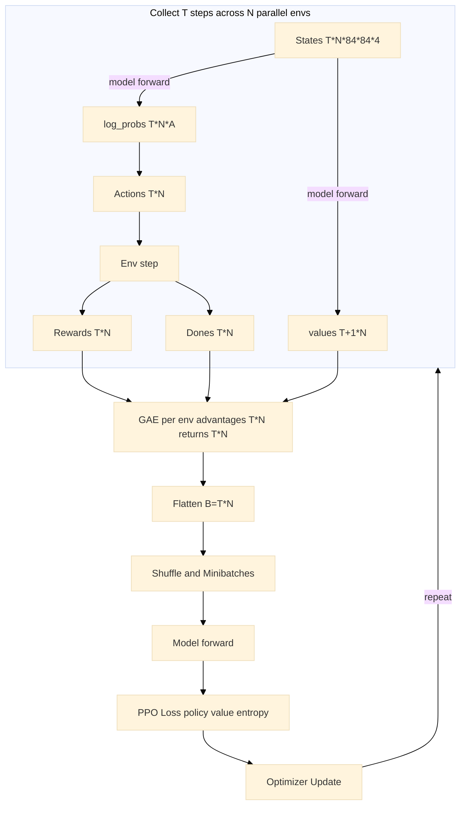
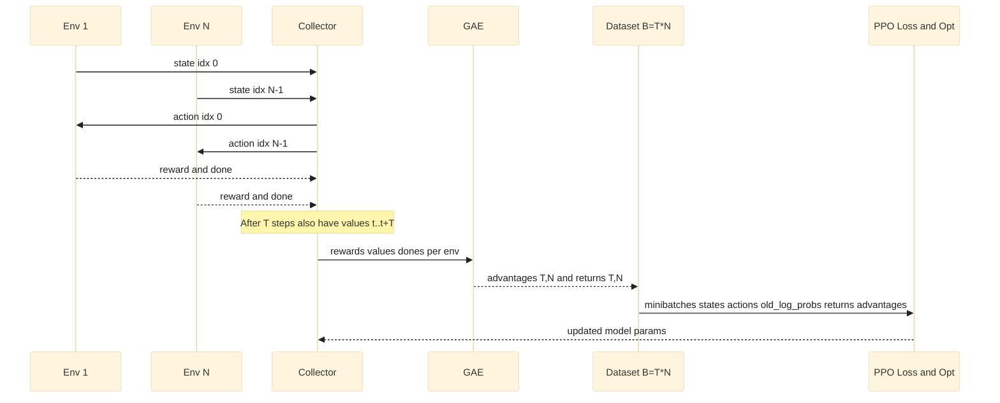

# PPO Summary: From Policy Gradient Theorem to State-of-the-Art GAE Implementation

This document provides a concise summary of the 8-step mathematical journey from the foundational policy gradient theorem to the sophisticated Generalized Advantage Estimation (GAE) used in modern PPO implementations.

## Step 1: Policy Gradient Foundation

**Core Objective:** Maximize expected return $J(\theta) = \mathbb{E}_{\tau \sim \pi_\theta}[R(\tau)]$

**Key Assumptions:**
- MDP Framework: States $S$, actions $A$, transitions $P(s'|s,a)$, rewards $R(s,a)$, discount $\gamma$
- Differentiability: Policy $\pi_\theta(a|s)$ differentiable w.r.t. $\theta$
- Stationarity: Time-invariant dynamics and policy (momentarily during gradient computation)

**Policy Gradient Theorem:**
$$\nabla_\theta J(\theta) = \mathbb{E}_{\tau \sim \pi_\theta}\left[\sum_{t=0}^{T-1} \nabla_\theta \log \pi_\theta(a_t|s_t) R_t\right]$$

**Key Equations:**
- Return: $R_t = \sum_{k=t}^{T-1} \gamma^{k-t} r_k$ (causality principle)
- Likelihood ratio trick: $\nabla_\theta \mathbb{E}_{x \sim p_\theta}[f(x)] = \mathbb{E}_{x \sim p_\theta}[f(x) \nabla_\theta \log p_\theta(x)]$

**Rationale:** Uses likelihood ratio trick and causality principle to derive unbiased gradient estimator. Log probability provides numerical stability, natural gradient interpretation, and mathematical elegance.

## Step 2: The High Variance Problem and Baseline Subtraction

**Problem:** Basic policy gradient suffers from extremely high variance, making learning unstable.

**Key Concepts:**
- **Variance**: Gradient estimates fluctuate around expected value across trajectory samples
- **Bias**: Systematic error between estimator expectation and true gradient

**Solution - Baseline Subtraction Theorem:**
$$\nabla_\theta J(\theta) = \mathbb{E}_{\tau \sim \pi_\theta}\left[\sum_{t=0}^{T-1} \nabla_\theta \log \pi_\theta(a_t|s_t) (R_t - b(s_t))\right]$$

**Key Insight:** $\mathbb{E}_{a \sim \pi_\theta}[\nabla_\theta \log \pi_\theta(a|s) b(s)] = 0$

**Optimal Baseline:** $b^*(s) \approx V^{\pi}(s) = \mathbb{E}_{a \sim \pi_\theta}[Q^{\pi}(s,a)]$

**Rationale:** Any state-dependent baseline can be subtracted without introducing bias, with state value function being the variance-minimizing choice.

## Step 3: Emergence of Advantage Functions

**Mathematical Derivation:** Using $V^{\pi}(s)$ as baseline leads to advantage functions:
$$A^{\pi}(s,a) = Q^{\pi}(s,a) - V^{\pi}(s)$$

**Advantage-Based Policy Gradient:**
$$\nabla_\theta J(\theta) = \mathbb{E}_{\tau \sim \pi_\theta}\left[\sum_{t=0}^{T-1} \nabla_\theta \log \pi_\theta(a_t|s_t) A^{\pi}(s_t, a_t)\right]$$

**Critical Property:** $\mathbb{E}_{a \sim \pi_\theta}[A^{\pi}(s,a)] = 0$ (zero-mean)

**Mathematical Proof:**
$$\mathbb{E}_{a \sim \pi_\theta}[A^{\pi}(s,a)] = \mathbb{E}_{a \sim \pi_\theta}[Q^{\pi}(s,a)] - V^{\pi}(s) = V^{\pi}(s) - V^{\pi}(s) = 0$$

**Rationale:** Advantages provide relative action quality information without introducing bias, ensuring unbiased policy gradient updates while reducing variance.

## Step 4: Temporal Difference (TD) Estimation

**Problem:** Direct computation of $Q^{\pi}(s,a)$ and $V^{\pi}(s)$ is intractable.

**TD Solution:** Use Bellman equation to estimate advantages:
$$\delta_t^V = r_t + \gamma V(s_{t+1}) - V(s_t)$$

**Key Assumptions:**
- Bellman Validity: $V^{\pi}(s_t) = \mathbb{E}_{\pi}[r_t + \gamma V^{\pi}(s_{t+1}) | s_t]$
- Markov Property: Future depends only on current state
- Value Function Accuracy: $V(s) \approx V^{\pi}(s)$

**Bias-Variance Tradeoff:**
- **Monte Carlo Direction**: Low bias, high variance (using actual rewards)
- **TD Direction**: High bias, low variance (using bootstrapped estimates)

**Advantage Approximation:** When $V(s) = V^{\pi}(s)$, then $\delta_t^V = A^{\pi}(s_t, a_t)$

**Rationale:** TD errors provide computationally tractable advantage estimates, introducing the fundamental bias-variance tradeoff in advantage estimation.

## Step 5: The Bias-Variance Tradeoff in Advantage Estimation

**Core Dilemma:**
- **TD Error ($\lambda=0$)**: $\hat{A}_t = \delta_t$ → High bias, Low variance
- **Monte Carlo ($\lambda=1$)**: $\hat{A}_t = \sum_{k=0}^{\infty} \gamma^k \delta_{t+k}$ → Low bias, High variance

**High Variance Sources:**
1. Stochastic rewards and environment transitions
2. Function approximation errors
3. Finite sampling

**Bias Sources:**
1. Value function approximation: $V_\phi(s) \ne V^{\pi}(s)$
2. Bootstrapping with estimated values
3. Finite horizon truncation

**Rationale:** Understanding the sources of bias and variance enables principled design of advantage estimators that balance these competing objectives.

## Step 6: Generalized Advantage Estimation (GAE) - The Optimal Solution

**Mathematical Foundation:**
$$\hat{A}_t^{GAE(\gamma,\lambda)} = \sum_{l=0}^{\infty} (\gamma\lambda)^l \delta_{t+l}^V$$

**Recursive Implementation:**
$$\hat{A}_t^{GAE} = \delta_t + \gamma\lambda \hat{A}_{t+1}^{GAE}$$

**Bias-Variance Control Parameter $\lambda$:**
- **$\lambda = 0$**: Pure TD → High bias, low variance
- **$\lambda = 1$**: Pure MC → Low bias, high variance  
- **$\lambda \in (0,1)$**: Optimal tradeoff → Exponentially weighted combination

**Key Assumptions:**
1. Exponential decay: Future information becomes less reliable exponentially
2. Geometric convergence: $|\gamma\lambda| < 1$ ensures series convergence
3. Finite horizon: Practical truncation at episode boundaries

**Rationale:** GAE provides principled interpolation between bias and variance, allowing practitioners to tune the $\lambda$ parameter for optimal performance in specific domains.

## Step 7: State-of-the-Art Implementation in PPO

**Practical GAE Algorithm:**
```python
import jax.numpy as jnp

def gae_advantages(rewards, terminal_masks, values, discount, gae_param):
    advantages = []
    gae = 0.0
    for t in reversed(range(len(rewards))):
        delta = rewards[t] + discount * values[t + 1] * terminal_masks[t] - values[t]
        gae = delta + discount * gae_param * terminal_masks[t] * gae
        advantages.append(gae)
    return jnp.array(advantages[::-1])
```

**Why Reversed Loop is Essential:**
- **Mathematical Dependency**: $\hat{A}_t^{GAE} = \delta_t + \gamma\lambda \hat{A}_{t+1}^{GAE}$ creates backward dependency chain
- **Boundary Condition**: $\hat{A}_T^{GAE} = \delta_T$ (terminal condition)
- **Computational Efficiency**: $O(T)$ linear time complexity
- **Terminal State Handling**: Prevents advantage bleeding across episodes

**Implementation Assumptions:**
- Neural network approximation: $V_\phi(s) \approx V^{\pi}(s)$
- Backward processing for efficient computation
- Terminal state handling: $V(s_{\text{terminal}}) = 0$
- Batch processing across parallel environments

**Hyperparameter Sensitivity:**
- $\gamma \in [0.95, 0.99]$: Discount factor
- $\lambda \in [0.9, 0.99]$: GAE parameter

**Rationale:** Efficient implementation that maintains mathematical correctness while enabling practical deployment in modern RL systems.

## Step 8: Integration with PPO Loss Function

**Final Policy Gradient with GAE:**
$$\nabla_\theta J(\theta) \approx \mathbb{E}_{\tau \sim \pi_\theta}\left[\sum_{t=0}^{T-1} \nabla_\theta \log \pi_\theta(a_t|s_t) \hat{A}_t^{GAE}\right]$$

**PPO Clipped Objective:**
$$L^{CLIP}(\theta) = \mathbb{E}_t[\min(r_t(\theta)\hat{A}_t^{GAE}, \text{clip}(r_t(\theta), 1-\epsilon, 1+\epsilon)\hat{A}_t^{GAE})]$$

where $r_t(\theta) = \frac{\pi_\theta(a_t|s_t)}{\pi_{\theta_{old}}(a_t|s_t)}$ is the importance sampling ratio.

**Key Components:**

1. **Importance Sampling Ratio**: Enables off-policy updates and sample reuse
   - Corrects for policy mismatch between data collection and updates
   - Mathematical foundation:
   $$\mathbb{E}_{\tau \sim \pi_\theta}[f(\tau)] = \mathbb{E}_{\tau \sim \pi_{\theta_{old}}}\left[\frac{\pi_\theta(\tau)}{\pi_{\theta_{old}}(\tau)} f(\tau)\right]$$

    **PPO's Hybrid On-Policy/Off-Policy Approach:**
    
    The use of importance sampling in PPO represents a **perfect example** of the on-policy/off-policy discussion in reinforcement learning, creating a sophisticated hybrid approach:
    
    **Traditional Distinction:**
    - **On-Policy Methods**: Learn about the policy being used to make decisions (e.g., REINFORCE, SARSA)
        - ✅ Theoretical guarantees
        - ✅ Stable training
        - ❌ Sample inefficient
    - **Off-Policy Methods**: Can learn from data generated by different policies (e.g., Q-learning, DQN)
        - ✅ Sample efficient
        - ✅ Can learn from any data
        - ❌ Can be unstable
        - ❌ Distribution mismatch issues
    
    **PPO's Innovation:**
    PPO bridges this gap through its two-phase process:
    - **Experience Collection**: Use policy $\pi_{\theta_{\text{old}}}$ (on-policy data collection)
    - **Multiple Updates**: Reuse same data for several gradient steps (off-policy learning with importance sampling correction)
    
    **The Fundamental Tradeoff PPO Solves:**
    ```
    Traditional On-Policy: π_θ_old → collect data → one update → π_θ_new → discard data → repeat
    PPO Approach: π_θ_old → collect data → multiple updates → π_θ_new (reuse same data!)
    ```
    
    **Why This Matters:**
    - **Sample Efficiency**: Can reuse data multiple times (like off-policy methods)
    - **Stability**: Clipping prevents destructive updates (like on-policy methods)
    - **Practical Performance**: Works well across diverse domains
    - **Theoretical Soundness**: Maintains convergence guarantees
    
    This hybrid approach demonstrates that the on-policy/off-policy distinction isn't binary but rather a spectrum, with PPO finding an optimal balance between sample efficiency and training stability.


2. **Clipping Mechanism**: Prevents destructively large policy updates
   $$\text{clip}(r_t(\theta), 1-\epsilon, 1+\epsilon) = \begin{cases}
   1-\epsilon & \text{if } r_t(\theta) < 1-\epsilon \\
   r_t(\theta) & \text{if } 1-\epsilon \leq r_t(\theta) \leq 1+\epsilon \\
   1+\epsilon & \text{if } r_t(\theta) > 1+\epsilon
   \end{cases}$$

3. **Complete PPO Loss:**
   $$L_{PPO}(\theta) = L^{CLIP}(\theta) - c_1 L^{VF}(\theta) + c_2 S[\pi_\theta]$$

**Theoretical Properties:**
- Conservative updates through clipping
- Monotonic improvement guarantees
- Sample efficiency via experience reuse
- Training stability through bounded policy changes

**Rationale:** Integration of GAE with PPO's clipped objective creates a theoretically sound and practically effective algorithm that balances sample efficiency, training stability, and performance.

## Summary of Key Benefits

1. **Variance Reduction**: GAE smooths noisy advantage estimates
2. **Bias Control**: $\lambda$ parameter enables fine-tuning of bias-variance tradeoff
3. **Sample Efficiency**: Better gradient estimates accelerate learning
4. **Stability**: Reduced gradient noise and clipping improve training stability
5. **Credit Assignment**: Multi-horizon consideration improves temporal credit assignment

## Theoretical Guarantees

- **Unbiasedness**: When $V(s) = V^{\pi}(s)$, GAE provides unbiased advantage estimates
- **Consistency**: As $\lambda \to 1$, GAE approaches Monte Carlo estimates
- **Convergence**: Maintains policy gradient theorem guarantees while improving practical performance

This progression represents a principled evolution driven by the fundamental bias-variance tradeoff, culminating in state-of-the-art advantage estimation used in modern PPO implementations.


## Practical Tensor Structures for PPO Optimization

This section ties the 8-step conceptual journey to the concrete tensors that flow into the PPO loss in this NNX-based implementation.

- Collection across parallel environments and time:
  - We run N parallel simulators for T steps to collect experience.
  - Raw stacks (before flattening):
    - states: shape (T, N, 84, 84, 4)
    - actions: shape (T, N)  (discrete action indices)
    - rewards: shape (T, N)
    - values: shape (T+1, N)  (bootstrap one extra value for GAE)
    - old_log_probs: shape (T, N)  (log π_{θ_old}(a_t|s_t))
    - dones: shape (T, N)  (1.0 at terminal, else 0.0)

- Per-environment GAE and returns (Step 6–7):
  - For each environment i ∈ {1,…,N}, form terminal masks m_t = 1 − done_t.
  - Call GAE with vectors of length T:
    - rewards[:, i] → (T,)
    - terminal_masks → (T,)
    - values[:, i] → (T+1,)
  - Compute for each env i:
    - advantages[:, i]: shape (T,)
    - returns[:, i] = advantages[:, i] + values[:-1, i]: shape (T,)

- Flatten for optimization (Step 8):
  - Define B = T × N (the total number of time-steps across all envs).
  - The training trajectories passed to the optimizer are flattened to:
    - states: (B, 84, 84, 4)
    - actions: (B,)  int32
    - old_log_probs: (B,)  float32
    - returns: (B,)  float32
    - advantages: (B,)  float32  (normalized inside the loss)

- Minibatching for the loss:
  - During an epoch, the flattened arrays are reshaped to (iterations, batch_size, …) and iterated.
  - The loss function consumes one minibatch tuple:
    - states: (batch_size, 84, 84, 4)
    - actions: (batch_size,)
    - old_log_probs: (batch_size,)
    - returns: (batch_size,)
    - advantages: (batch_size,)
  - Model outputs for discrete actions:
    - log_probs: (batch_size, num_actions)
    - values: (batch_size, 1) → squeezed to (batch_size,)

- What the PPO loss computes per minibatch (high level):
  - Gather log_probs_act_taken = log_probs[j, actions[j]] per sample.
  - Ratio r_t = exp(log_probs_act_taken − old_log_probs).
  - Normalize advantages: (A − mean(A)) / (std(A) + 1e−8).
  - Policy loss = −mean(min(r_t·A, clip(r_t, 1−ε, 1+ε)·A)).
  - Value loss = mean((returns − values)^2).
  - Entropy bonus = mean categorical entropy of the policy.

Concrete examples

1) Typical Atari-like setup (discrete actions)
- Suppose T = 128 rollout steps and N = 8 environments, so B = 1024.
- num_actions = 4 (example).
- After flattening:
  - states.shape = (1024, 84, 84, 4), dtype=float32
  - actions.shape = (1024,), dtype=int32, e.g. [1, 0, 3, 2, 1, …]
  - old_log_probs.shape = (1024,), e.g. [−0.69, −1.20, −0.92, …]
  - returns.shape = (1024,), e.g. [0.43, 0.51, −0.12, …]
  - advantages.shape = (1024,), normalized to mean≈0 and std≈1
- A single minibatch with batch_size = 256 would have the same per-field shapes with 256 instead of 1024.

2) Tiny end‑to‑end toy snapshot (T = 2, N = 3 ⇒ B = 6)
- Flattened tensors passed into one loss evaluation (batch_size = 6):
  - states: (6, 84, 84, 4)
  - actions: [2, 0, 1, 3, 1, 0]
  - old_log_probs: [−1.20, −0.69, −1.10, −1.39, −0.75, −1.25]
  - returns: [0.97, 0.12, −0.05, 0.22, 0.08, −0.11]
  - advantages (before normalization): [0.50, −0.10, 0.20, −0.30, 1.00, −1.30]
  - advantages (after normalization inside loss): mean≈0, std≈1
- The model produces:
  - log_probs: (6, num_actions)
  - values: (6, 1) → (6,)
- The loss then computes r_t, applies clipping with ε, value MSE to returns, and adds an entropy bonus.

Notes and edge cases
- Terminal handling: masks prevent advantages from leaking across episode boundaries.
- Dtypes: actions are integer indices; all other scalars are float32.
- Continuous action variants would use actions shaped (B, action_dim) and log-prob scalars per sample, but this example uses discrete actions (categorical policy).


## Visualizing the PPO Data Process

A concise way to understand how tensors move through PPO is to visualize the pipeline from rollout collection to the optimized update.

Flowchart overview



End-to-end interaction (sequence)



What to plot while debugging or explaining the flow

- Advantages histogram: expect mean≈0 after normalization, track std.
- Policy ratio r_t histogram and clip fraction: how often clipping is active.
- Value loss and returns vs. predicted values scatter: calibration of critic.
- Entropy and action distribution: policy exploration over time.
- Episode length/reward curves: aligns with data segmentation and masks.

Tip: These can be logged with TensorBoard; this repo already writes scalar game_score. Adding histograms for advantages and ratios in the training loop can make these plots immediately available.
