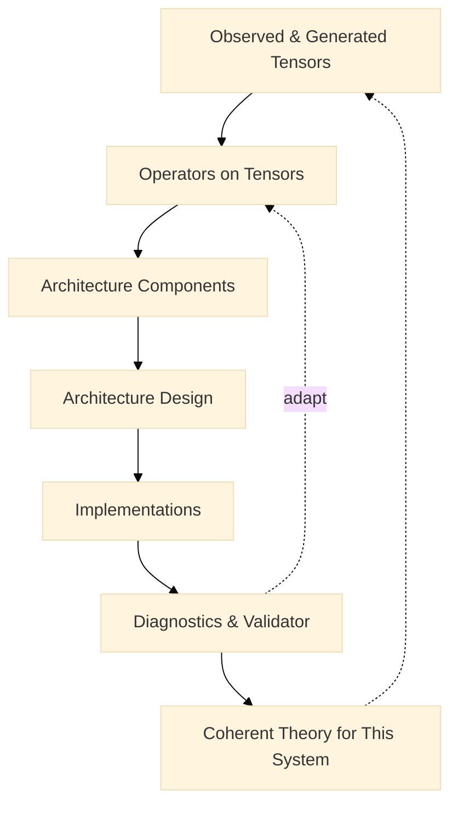

# Reversed RL (RRL) for System Engineers

A modest, practical abstraction to design RL systems from shapes to loss under real compute constraints. RRL starts with the tensors you can actually collect and optimize, then composes operators that consume those tensors to produce losses. Architectures are chosen to satisfy the operator interfaces, not the other way around.

This document complements PPO materials in this folder and provides a compact, engineer‑oriented reference with:
- A capability view of the batch contract
- Operator manifests (requirements, options, numerical hygiene)
- Pseudocode for the training loop
- Two ready‑to‑run configs to compare with/without a value network





Diagram notes (details moved out of nodes to avoid truncation):
- Observed & Generated Tensors: shapes for GD
- Operators on Tensors: estimators, builders, regularizers
- Architecture Components: loss terms, params, schedules
- Architecture Design: policy / value / Q; sequence / dynamics
- Implementations: collector, optimizer, sharding
- Diagnostics & Validator: masks, KL / ESS, calibration
- Coherent Theory for This System: constraints-aware
---


## 1) Batch contract (shapes → loss)

Role‑tagged tensors (present only if needed by chosen operators):

- Identity/masks: `mask.valid` [B], `mask.terminal` [B]
- Observations/actions: `obs` [B,*S], `act` [B] or [B,D]
- Rewards/discounting: `rew` [B], `gamma` [B]
- Behavior/reference: `ref.logp` [B] (aka old logp), `behavior.logp` [B] (dataset policy; optional)
- Targets/signals: `target.adv` [B], `target.value` [B], `target.q` [B]
- Sequence (optional): `seq.rtg` [B], `seq.timestep` [B], `seq.attn_mask` [B,T]
- Weights (optional): `weight.entropy` [B], `weight.kl` [B], `weight.sample` [B]

Technical symbols use GitHub‑friendly LaTeX:

- Advantage: $A_t$; Returns/targets: $R_t$; Importance ratio: $r_t = \exp(\log\pi_\theta(a_t\mid o_t) - \log\pi_{\text{old}}(a_t\mid o_t))$.
- GAE deltas: $\delta_t = r_t + \gamma (1-d_t) V(o_{t+1}) - V(o_t)$; $A_t$ via $\lambda$‑smoothing.

Display form examples:

$$
\mathcal{L}_\pi(\theta) = \mathbb{E}\,\Big[\min\big(r_t A_t,\; \mathrm{clip}(r_t,1-\varepsilon,1+\varepsilon) A_t\big)\Big]
$$

---

## 2) Capability view

Use capability flags to validate operator selection and fallbacks.

| Capability | Meaning | Enables |
|---|---|---|
| has_ref_logp | `ref.logp` present (on‑policy snapshot) | PG‑clip, KL penalties |
| has_obs_next | `obs_next`, `rew`, `gamma` present | TD/Huber, off‑policy critics |
| sequence_mode | sequence tensors present | DT/sequence BC |
| offline_mode | no on‑policy collection, optional `behavior.logp` | AWR/IQL/CQL |

Notes:
- Always multiply losses by `mask.valid`.
- Keep shapes static across steps to avoid recompiles.

---

## 3) Operator manifests (primitives)

Each operator declares required fields; optional fields refine stability. Pseudocode manifests below.

```text
Operator: PGClip (PPO‑style policy gradient)
requires: obs, act, ref.logp, target.adv, mask.valid
optional: weight.entropy, weight.kl
loss: L = −E[min(r*A, clip(r,1−ε,1+ε)*A)] − β·H + α·KL(ref||curr)
notes: normalize A per batch; track ratio histograms and clip fraction
```

```text
Operator: ValueMSE (critic)
requires: obs, target.value, mask.valid
optional: ref.value for clipped value loss
loss: L = E[0.5·(Vθ(obs) − target.value)^2]
notes: monitor value calibration; optional clipping against ref.value
```

```text
Operator: TDHuber (Q‑learning)
requires: obs, act, rew, gamma, obs_next, mask.valid
loss: L = E[ huber(Qθ(s,a) − target.q) ]
notes: compute target.q with target network; mask terminals
```

```text
Operator: AWRPolicy (offline/adv‑weighted BC)
requires: obs, act, target.adv, mask.valid
loss: L = E[ clip(exp(A/β), w_max) · (−logπθ(a|s)) ]
notes: choose β, w_max by throughput/variance constraints
```

---

## 4) Builders (signals from rollouts)

Pseudocode (fenced code) for common builders:

```python
def add_gae(batch, V, gamma: float, lam: float):
    # expects: rew[T,N], done[T,N], values[T+1,N]
    # produces: target.adv[T,N], target.value[T,N]
    adv = zeros_like(rew)
    gae = 0.0
    for t in reversed(range(T)):
        delta = rew[t] + gamma * (1 - done[t]) * values[t+1] - values[t]
        gae = delta + gamma * lam * (1 - done[t]) * gae
        adv[t] = gae
    target_value = adv + values[:-1]
    return batch.update({"target.adv": adv, "target.value": target_value})
```

```python
def add_logp_ref(batch, policy, params_frozen):
    # compute and store ref.logp under acting params
    logp_old = policy.log_prob(params_frozen, batch["obs"], batch["act"]) 
    return batch.update({"ref.logp": logp_old})
```

---

## 5) Generic training loop (pure function style)

```python
# Pseudo‑API
loss, metrics = aggregator.apply(operators, batch, model_fns, hyper, rng)
optimizer.step(loss)
```

```python
# PPO‑like skeleton
for step in range(num_updates):
    roll = collector.run(policy, T, N)  # yields obs, act, rew, done, values, logp_old
    batch = builders.add_gae(roll, V=values, gamma=γ, lam=λ)
    batch = {k: v.reshape(B, *v.shape[2:]) for k, v in batch.items()}  # B=T*N
    for epoch in range(K):
        for mb in minibatches(batch, size=MB):
            L = L_pg_clip(mb) + c_v*L_value(mb) + L_entropy(mb) + L_kl(mb)
            optimizer.step(L)
```

---

## 6) Two ready‑to‑run configs (compare with/without value)

Both configs are Python files returning an `ml_collections.ConfigDict`, matching `examples/ppo_nnx/ppo_main.py`.

- With value (standard PPO): `configs/crf_with_value.py`
- Policy‑only (no value loss): `configs/crf_policy_only.py` (sets `vf_coeff=0.0`)

Run examples:

```bash
# Standard PPO with value loss
python -m examples.ppo_nnx.ppo_main \
  --config=examples/ppo_nnx/configs/crf_with_value.py \
  --workdir=/tmp/ppo_crf_value

# Policy‑only variant (no value loss). Note: the critic output exists but is not trained.
python -m examples.ppo_nnx.ppo_main \
  --config=examples/ppo_nnx/configs/crf_policy_only.py \
  --workdir=/tmp/ppo_crf_policy_only
```

---

## 7) Equations (for reference)

GAE and PPO objectives in display math:

$$
\delta_t = r_t + \gamma (1-d_t) V(o_{t+1}) - V(o_t),\quad
A_t = \sum_{\ell\ge 0} (\gamma\lambda)^{\ell} \, \delta_{t+\ell}
$$

$$
\mathcal{L}_\pi = \mathbb{E}\,\Big[\min(r_t A_t, \operatorname{clip}(r_t,1-\varepsilon,1+\varepsilon) A_t)\Big],\quad
\mathcal{L}_V = \tfrac{1}{2}\,\mathbb{E}[(V_\theta(o_t) - R_t)^2]
$$

---

## 8) Practical notes

- If you want a true REINFORCE baseline‑free run, set `vf_coeff=0.0` and modify the collector to use $V(o_t)=0$ when building $A_t$ (not provided in this minimal example). The provided policy‑only config runs without training the value loss.
- Track diagnostics: ratio histograms, clip fraction, entropy, value calibration.
- Keep batch schemas and dtypes fixed to avoid recompiles under JIT.

---

## 9) RRL in context: Is this approach new?

Short answer:
- Conceptually, similar ideas exist (data‑centric ML, TRFL/RLax operators, Acme/RLlib systems, RLHF preference‑optimization, Decision Transformer). Many of these start from the batch/loss under compute constraints.
- As a cohesive, capability‑aware engineering methodology, RRL is distinctive: it elevates a role‑tagged tensor contract, operator manifests with explicit preconditions, a validator + diagnostics loop, and data‑driven adaptivity into a single, reproducible flow.

Relevant precedents (for honest positioning):
- Data‑centric AI (Ng) and “Software 2.0” (Karpathy): prioritize the objective/data contract; models serve the loss.
- Operator libraries: TRFL, RLax provide reusable RL targets/losses as tensor ops.
- Systems frameworks: Acme, RLlib stress capability‑driven components and validators.
- RLHF/RLAIF: batch‑first preference objectives (e.g., DPO/IPO/KTO) where batch fields dictate losses.
- Decision Transformer: sequence‑first schema (tokens, RTG, masks) → objective.

What feels distinctive in RRL (the value add):
- Role‑tagged batch as the primary API with explicit capability flags (e.g., has_ref_logp, has_obs_next, sequence_mode, offline_mode).
- Operator manifests with numerical hygiene (mask semantics, clipping/normalization, stop_gradient) and stated preconditions/costs.
- Validator + diagnostics that can add/remove operators or require new tensors when assumptions fail; fallbacks are explicit and measured.
- Data‑driven adaptivity built‑in: e.g., KL targeting and per‑sample clipping derived from batch statistics, not static knobs.
- Engineering‑first documentation with runnable ablations (with/without value network) under identical batch contracts.

Is it “new enough” to matter?
- Engineering practice: yes—RRL improves reproducibility, comparability, and iteration speed by fixing the batch contract and separating operators from models.
- Research novelty: potentially—if you formalize validator behavior and adaptive operators and validate across methods/datasets.

Concrete avenues to push novelty (examples):
- Assumption/capability checker that auto‑disables or re‑wires operators, logging the induced bias/variance trade‑off.
- Per‑sample adaptive clipping $\varepsilon_i$ from gradient‑variance proxies $\hat{\sigma}_{g,i}$; compare to fixed $\varepsilon$ on stability/sample‑efficiency.
- KL‑targeting with multiplicative updates to maintain a target divergence:

  $$\alpha \leftarrow \alpha \cdot \exp\big(\eta\,(\bar D_{\mathrm{KL}} - D_{\text{target}})\big).$$

- Unified diagnostics with pass/fail bands (ratio histograms centered near 1, clip fraction in healthy range, ESS thresholds, value calibration $R^2$) that predict instability and auto‑tune penalties.
- Cross‑family instantiations (PPO, REINFORCE+baseline, AWR) from the same batch + operators; quantify code delta and performance under equal compute.

How to position RRL:
- Not a brand‑new philosophy; a disciplined unification of scattered best practices.
- New as a coherent, capability‑aware, diagnostics‑driven engineering framework that starts from shapes → operators → loss, then lets theory serve the system.


---

## 10) RRL beyond RL: Applying to AI systems

### Short answer
Yes—RRL generalizes well beyond RL. Most modern AI workflows can be framed as: define the batch/tensor contract you can actually optimize under compute and governance constraints, choose operators (losses/estimators/regularizers) that consume those tensors, then pick architectures that satisfy those operator interfaces. The novelty is making this pipeline explicit, capability‑aware, and validation‑driven.

### Where this approach applies naturally
- Supervised learning
  - Tensors: $(x, y)$, masks/weights per sample.
  - Operators: cross‑entropy, label smoothing, focal loss, cost‑sensitive weights, calibration penalties.
  - Diagnostics: per‑class metrics, long‑tail slices, calibration curves.
- Self‑supervised / contrastive / masked objectives
  - Tensors: paired views/augmentations, indices, attention masks.
  - Operators: InfoNCE, BYOL/VICReg invariance/variance/covariance losses, masked LM loss.
- Generative models
  - Diffusion: $(x_0, t, \epsilon, c)$ with schedules.
  - Autoregressive LMs: token ids, attention masks; optional preference/reward signals.
- RLHF/RLAIF and post‑training
  - Tensors: prompts, responses (policy vs reference), pairwise preferences or rewards, KL weights.
  - Operators: DPO/IPO/KTO; KL penalties/constraints.
- Recommenders / counterfactual learning
  - Tensors: $(u,i,\text{context}), y$, propensities $p(i\mid u)$, position bias.
  - Operators: IPS/DR losses, pairwise/listwise ranking, calibration/coverage constraints.
- Multimodal and RAG
  - Tensors: text tokens, vision embeddings, retrieval scores, grounding masks.
  - Operators: contrastive alignment, cross‑modal CE, retrieval‑temperature regularization, hallucination penalties.

### What must be adapted to go beyond RL
- Sequence/history roles: standardize attention masks, timestep/position, segment/pack IDs; keep masking rigorous.
- Non‑gradient or hybrid operators: allow backends that output parameter deltas or pseudo‑targets (e.g., fitted iteration, search distillation).
- Streaming/online learning: windowed batches, recency weights, change‑point detection; time‑aware roles.
- Constraints/safety: add role‑tagged cost vectors and per‑sample constraint masks; include primal‑dual operators.
- Capabilities & governance: capability flags (has_labels, has_pairs, has_propensity, has_ref_logits, sequence_mode, private_mode); validators enforce preconditions and fallbacks.

### Pitfalls and mitigations
- Hidden preconditions
  - Risk: selecting operators requiring fields not present (e.g., propensities, behavior logits).
  - Mitigation: validators that check required roles; quantify induced bias/variance if fallbacks are used; fail fast when unacceptable.
- Leaky masking and ragged sequences
  - Mitigation: masked losses and metrics by default; unit tests for pack/leakage; attention‑mask audits.
- Static‑hyper over‑regularization
  - Mitigation: data‑driven adaptivity (target KL/ESS via multiplicative updates); log control signals.
- Overfitting to hardware quirks
  - Mitigation: keep role‑tagged, shape‑polymorphic schemas; document constraints without hard‑wiring them.

### Concrete examples (batches, operators, snippets)
- LLM preference optimization (DPO)
  - Batch: prompt, chosen/rejected responses, optional reference logits or KL weight $\alpha$.
  - Operator: DPO loss consuming pairwise log‑prob differences and $\alpha$.
  - Pseudocode:
  ```python
  def dpo_loss(policy, ref, batch, alpha):
      # expects: prompt, y_pos, y_neg (tokenized), attn_masks
      lp_pos = policy.logp(batch.prompt, batch.y_pos)
      lp_neg = policy.logp(batch.prompt, batch.y_neg)
      lr_pos = ref.logp(batch.prompt, batch.y_pos)
      lr_neg = ref.logp(batch.prompt, batch.y_neg)
      diff = (lp_pos - lp_neg) - (lr_pos - lr_neg)
      return -jnp.mean(jax.nn.log_sigmoid(alpha * diff))
  ```
- Vision contrastive (InfoNCE)
  - Batch: two augmented views per image.
  - Operator:
  ```python
  def info_nce(z1, z2, tau=0.1):
      z1, z2 = l2_normalize(z1), l2_normalize(z2)
      logits = z1 @ z2.T / tau
      labels = jnp.arange(z1.shape[0])
      return (ce(logits, labels) + ce(logits.T, labels)) / 2
  ```
- Diffusion training
  - Batch: $(x_0, t)$ and noise $\epsilon$; operator is weighted $\epsilon$‑prediction MSE.
  ```python
  def diffusion_eps_loss(model, x0, t, noise):
      xt = q_sample(x0, t, noise)
      eps_pred = model(xt, t)
      w = loss_weight(t)
      return jnp.mean(w * (eps_pred - noise)**2)
  ```
- Recommender with IPS
  - Batch: $(u,i,y)$ with propensity $p(i|u)$.
  - Operator (IPS‑weighted CE):
  ```python
  def ips_loss(logits, items, y, propensity, clip=0.1):
      w = jnp.minimum(1.0/propensity, 1.0/clip)
      return jnp.mean(w * ce(gather_logits(logits, items), y))
  ```

### Packaging template for “AI‑in‑general” teams
- Batch contract template
  - Core: inputs, targets/labels, masks, weights.
  - Optional: behavior/reference stats, sequence roles, uncertainty, constraints, provenance.
  - Capability flags: has_labels, has_pairs, has_propensity, has_ref_logits, sequence_mode, private_mode.
- Operator manifests
  - Required/optional fields, preconditions, numerical hygiene (normalization, clipping, stop_gradient), compute/memory notes.
- Validator
  - Compatibility checks; actionable messages; bias/variance accounting when using fallbacks.
- Diagnostics‑as‑contract
  - Minimal per domain: e.g., calibration and per‑slice accuracy for supervised; KL/ESS for preference/RLHF; IPS variance and ESS for recommenders; collapse indicators for SSL.
- Adaptive knobs
  - Standardize KL targeting, per‑sample clipping from variance proxies, temperature schedules, uncertainty weighting.

### Bottom line
RRL is a general engineering methodology: start from the tensors you can sustainably collect and optimize, select operators that are statistically sound under those constraints, choose architectures to satisfy operator interfaces, and let validators/diagnostics enforce assumptions. This pattern scales across supervised, self‑supervised, generative, recommender, RLHF, and multimodal systems with minimal extensions.


---

## Appendix: Where the RRL terms come from (contract, fields, operators, builders)

### Why we use this vocabulary
These labels make RL training loops explicit, swappable, and testable. They’re engineering-first names borrowed from software and numerical computing so you can reason from shapes → loss → implementation without hiding assumptions. They also generalize across RL families (PPO, DQN, IQL/DT) and beyond RL (SFT/DPO, contrastive, diffusion).

### Origins and why they help
- Contract (batch contract)
  - Origin: API/data schema design, design-by-contract.
  - Purpose: declare the minimal, sufficient tensors the optimizer will see (and their shapes/masks). Keeps compute, memory, and reproducibility front-and-center.
- Fields (role‑tagged tensors)
  - Origin: typed records/structs.
  - Purpose: bind by meaning (e.g., `ref.logp`, `target.adv`) instead of tuple positions; reduces wiring bugs and eases ablations.
- Operator (loss/estimator/regularizer)
  - Origin: functional/numerical programming; TRFL/RLax expose RL objectives as operators.
  - Purpose: a pure(ish) function consuming specific fields and producing a loss term and metrics (e.g., PPO surrogate, value MSE, entropy, KL).
- Builder (signal construction)
  - Origin: builder pattern and ML feature/target pipelines.
  - Purpose: compute upstream signals operators need (GAE, TD targets, logp snapshots, RTG, uncertainty weights) from raw rollouts/data.
- Aggregator (objective composer)
  - Origin: standard DL loss composition.
  - Purpose: sum weighted operator outputs; apply masks/weights; return total loss and per-term diagnostics.
- Validator (capability checker)
  - Origin: systems configuration validation.
  - Purpose: ensure operators’ preconditions match the contract; fail fast or provide measured fallbacks and explicit caveats.

### Glossary (engineer’s view)

| Term | Comes from | In RRL it means |
|---|---|---|
| Contract | API/schema design | The role‑tagged batch your optimizer consumes (e.g., `obs`, `act`, `ref.logp`, `target.adv`, `mask.valid`). |
| Field | Typed records | A named tensor with a role and shape, e.g., `target.value: [B]`. |
| Operator | Numerical ops/TRFL/RLax | A loss/estimator that declares required fields and outputs a scalar term + metrics. |
| Builder | Pipeline/builder pattern | Function that populates fields (e.g., add GAE advantages and returns). |
| Aggregator | Loss composition | Composes operator terms into the total loss with masks and weights. |
| Validator | Config validation | Checks capabilities and preconditions; suggests fallbacks when missing. |

### How these map onto this PPO NNX repo
- Contract/Fields
  - Produced by collection + processing in `ppo_lib.process_experience(...)`:
    - `states, actions, old_log_probs, returns, advantages` → this is the batch contract for PPO.
- Builder
  - `ppo_lib.gae_advantages(...)` computes $A_t$; `process_experience` constructs `returns = A_t + V(s_t)$ (where $V$ comes from rollout values).
- Operators (sub-terms of the objective)
  - Implemented inside `ppo_lib.loss_fn(...)`:
    - PPO clipped policy surrogate (policy operator)
    - Value MSE (critic operator)
    - Entropy bonus (regularizer)
- Aggregator
  - `loss_fn` sums policy, value (weighted by `vf_coeff`), and entropy (weighted by `entropy_coeff`).
- Validator
  - Currently implicit (shape assertions, assumptions like `rewards.shape[0] + 1 == values.shape[0]` in `gae_advantages`). In RRL, this becomes explicit capability checks (e.g., `has_ref_logp`).

### Minimal end‑to‑end sketch (RRL terms in code form)
```python
# 1) Contract/Fields produced by the collector + builders
roll = collector.run(policy, T, N)  # obs, act, rew, done, values, logp_old
adv, target_value = add_gae(
    rew=roll.rew, done=roll.done, values=roll.values, gamma=0.99, lam=0.95)

batch = {
    "obs": roll.obs.reshape(B, *S),
    "act": roll.act.reshape(B),
    "ref.logp": roll.logp_old.reshape(B),
    "target.adv": adv.reshape(B),
    "target.value": target_value.reshape(B),
    "mask.valid": (1.0 - roll.done.reshape(B)).astype(bool),
}

# 2) (Optional) validator checks operator requirements
# validator.require(batch, fields={"obs","act","ref.logp","target.adv","mask.valid"})

# 3) Operators consume fields; aggregator composes the objective
L = (
   L_pg_clip(model, batch)           # policy operator
 + cfg.vf_coeff * L_value_mse(model, batch)   # critic operator
 - cfg.entropy_coeff * L_entropy(model, batch) # regularizer
)
optimizer.step(L)
```

Notes:
- All operators multiply by `mask.valid` internally to avoid gradients through invalid samples.
- Advantage normalization (per-batch) is a numerical hygiene step often done inside the policy operator.
- Missing fields should trigger validator guidance (e.g., no `ref.logp` → disable PG‑clip and suggest BC or snapshotting log‑probs during collection).


### CT/FP view of RRL (engineer’s take)

RRL’s “shapes → operators → objective” aligns with ideas from category theory and functional programming (FP). This mapping gives you composability, testability, and safety without overformalizing the pipeline.

- Batch contract (role‑tagged tensors)
  - CT/FP: an object (product type/record). Projections are fields; the contract is the type signature of the optimizer input.
- Fields (e.g., `obs`, `act`, `ref.logp`, `target.adv`, `mask.valid`)
  - CT/FP: components of a product; accessed/updated via lenses.
- Builders (signal constructors like GAE, TD targets)
  - CT/FP: endomorphisms on the Batch (Batch → Batch) or arrows Batch → Batch′; often live in Writer/State monads because they “add fields.”
- Operators (loss/estimator/regularizer)
  - CT/FP: morphisms/arrows that consume a Batch and produce (LossTerm × Metrics). With params/RNG, model them as Kleisli arrows (Reader for params, Random for RNG, State for optimizer if needed).
- Aggregator (objective composer)
  - CT/FP: monoid homomorphism—fold a set of loss terms (monoidal under +) into a scalar.
- Validator (capability checker)
  - CT/FP: Validation applicative/Either; accumulate precondition errors instead of failing at the first one.
- Composition graph (of builders/operators)
  - CT/FP: a DAG of arrows; often a monoidal category for parallel composition.
- Masks/weights (`mask.valid`, `weight.sample`, etc.)
  - CT/FP: semiring/monoid structure that gates contributions (e.g., masked sums).

Practical, minimal snippets (FP‑flavored pseudocode):

```python
# 1) Validation applicative for capability checks
class V:
    def __init__(self, value=None, errors=None):
        self.value, self.errors = value, (errors or [])
    @staticmethod
    def ok(x): return V(value=x)
    @staticmethod
    def err(msgs): return V(errors=list(msgs))
    def map(self, f):
        return self if self.errors else V.ok(f(self.value))
    def bind(self, f):  # then/bind
        return self.map(f)

def require(batch, fields):
    missing = [f for f in fields if f not in batch]
    return V.err([f"missing field: {m}" for m in missing]) if missing else V.ok(batch)
```

```python
# 2) Builder as a pure endomorphism on the batch (Batch -> Batch)
def add_gae(batch, gamma: float, lam: float):
    v = require(batch, ["rew", "done", "values"])  # values has T+1

    def build(b):
        rew, done, values = b["rew"], b["done"], b["values"]
        T = rew.shape[0]
        adv = jnp.zeros_like(rew)
        gae = 0.0
        for t in range(T - 1, -1, -1):
            delta = rew[t] + gamma * (1 - done[t]) * values[t+1] - values[t]
            gae = delta + gamma * lam * (1 - done[t]) * gae
            adv = adv.at[t].set(gae)
        target_value = adv + values[:-1]
        return {**b, "target.adv": adv, "target.value": target_value}

    return v.map(build)
```

```python
# 3) Operator (PG‑clip) as an arrow with effects (Reader params, Random rng)
def pg_clip(params, rng, batch, eps, ent_w=0.0, kl_w=0.0):
    # requires: obs, act, ref.logp, target.adv, mask.valid
    logp, entropy = policy_logp_and_entropy(params, batch["obs"], batch["act"])
    r = jnp.exp(logp - batch["ref.logp"])  # importance ratio
    A = batch["target.adv"]
    A = (A - A.mean()) / (A.std() + 1e-8)  # numerical hygiene
    mask = batch["mask.valid"].astype(jnp.float32)

    pg = -jnp.minimum(r * A, jnp.clip(r, 1 - eps, 1 + eps) * A)
    L_pg = jnp.mean(pg * mask)
    L_ent = -ent_w * jnp.mean(entropy * mask)
    L_kl = kl_w * jnp.mean((batch["ref.logp"] - logp) * mask)

    loss = L_pg + L_ent + L_kl
    metrics = {
        "clip_frac": jnp.mean((jnp.abs(r - 1.0) > eps) * mask),
        "entropy": jnp.mean(entropy * mask),
    }
    return loss, metrics
```

```python
# 4) Aggregator: monoidal fold over operator terms
# weighted_terms: list of tuples (weight, loss_term)
def aggregate(weighted_terms):
    return sum(w * L for (w, L) in weighted_terms)  # (+, 0) monoid
```

```python
# 5) Lens‑like helpers for field updates (ergonomic but optional)
def lens_get(batch, key):
    return batch[key]

def lens_set(batch, key, value):
    return {**batch, key: value}

# Example: normalize advantages via a lens
A = lens_get(batch, "target.adv")
A_hat = (A - A.mean()) / (A.std() + 1e-8)
batch = lens_set(batch, "target.adv", A_hat)
```

Why this helps (without overformalizing):
- Composability: builders/operators are just functions you can compose and swap; ablations are local changes.
- Testability: pure, deterministic transformations are trivial to unit test.
- Safety: validators make assumptions explicit and catch missing preconditions early.
- Performance: purity and shape stability align with JIT/XLA; role‑tagged fields reduce wiring mistakes that cause recompiles.

Caveat: Don’t overfit to the abstraction—practical constraints (padding, sharding, static shapes) sometimes require light impurity (e.g., in‑place buffers) for performance.
